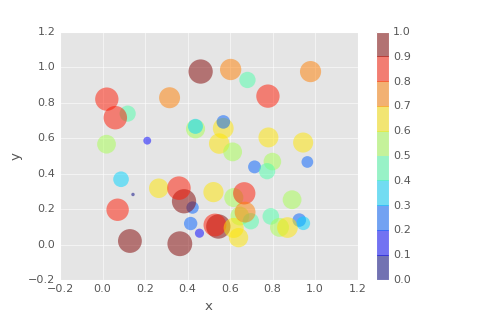
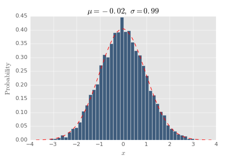
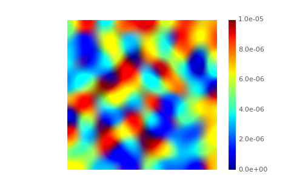
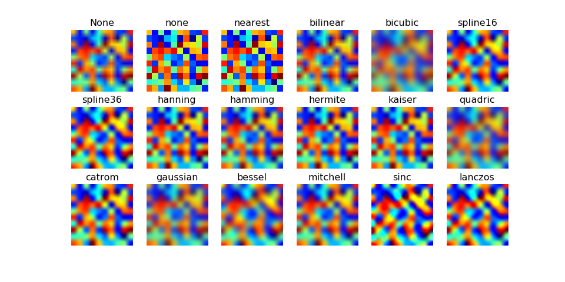
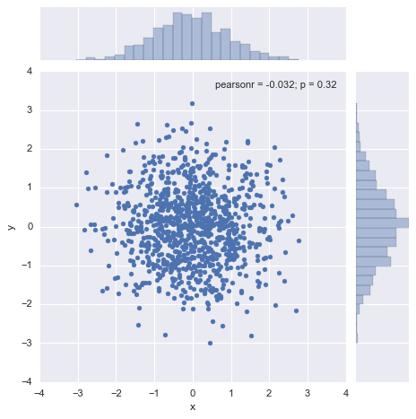
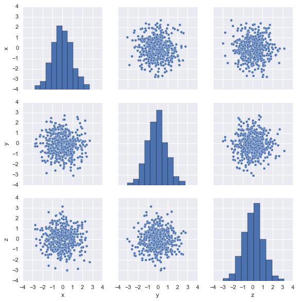

# Python DataViz Gallery

A collection of Python data visualization in Jupyter Notebooks

## Scatter Plot in matplotlib

## Histogram in matplotlib

## Heatmap in matplotlib

## Small Multiples in matplotlib

## Scatter Plot in Seaborn

## Pair Plot in Seaborn

